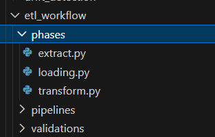
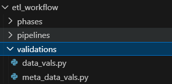
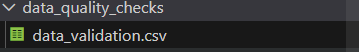
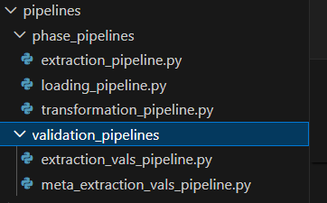

# ML SYSTEM FOR REGRESSION PROBLEM

This is a machine learning system designed for a regression medical cost problem.We predict the annual medical cost of clients based on their historical available data including transictions.

At first we extract the data,transform it and load it into the lakehouse .
Throughout each phase of data extraction,data quality checks are performed using great_expectations to ensure that we collected and are working with the correct data before machine learning 
comes into play. 

From there,we develop the models using the data we extracted and transformed in order to make future predictions. However since the aim is to develop a machine learning system ,in this case,we are working on a batch machine learning system. It should be noted that a batch machine learning system is the type of machine learning system in which we make predictions offline. This means that there might be no need to include online hosting using FastAPI to send predictions to the users but in a case where such should be made,Kafka plays a huge role.

Back to the system, model quality checks are performed in the same manner as data quality checks but with more consideration and focus on model metrics now.
Drift detection and feature selection are also performed with the use of deepchecks and a mathematical formulae developed with the use of statistical modeling rather than using built-in scikit-learn methods. Models ,metrics,data quality and model quality checks results are all saved in certain respective folders for proper structure of the distributed system.

Tools and libraries used in the workflow can be found in the requirements.txt file.

----

## Setup and Virtual Environment:

The first step before running any code or creating any files is creating a vritual environment to install these dependencies that will be used to accomplish the system. 
Using Windows,the following command on a Powershell terminal in vscode can be used to create the virtual environment:

python -m venv med_env

med_env is the name of the virtual environment ,it should be noted that one can name it as they like.

Then to activate the environment:

.\med_env\Scripts\Activate.ps1 

replacing med_env with the name of the virtual environment created

----

## ETL Workflow:

In the ETL workflow ,we are concerned with getting our hands on the dataset first.  The dataset is extracted from the database with the use of SQLAlchemy ,transformed with the use of pandas and loaded into the hopsworks lakehouse for future analytics and consumption. As explained in the each ETL phase,data quality checks are performed to ensure clean ,reliable ,consistent and accurate data before further 
work with it.

Here is the picture demonstrating how the ETL workflow is structured:

Only three folders are found-phases,pipeline and validations.

phases is where ETL is performed,pipelines for orchestrated pipelines that can be rescheduled and validations for data quality checks or data validations.

We focus on the etl_workflow which is in the src folder

----

### ETL Phases:

ETL Phases are executed first in the system. That is we need the data for machine learning consumption. Without data,no system can be built.
In the ETL PHASES workflow and structure

Only three phases -extract,transform and loading.

### Step 1: Extraction
Extract the raw data from the database with the use of SQLAlchemy and Pandas. 
Use dotenv and os libraries in Python to get the credentials and coonnect to the database for querying.
After extracting the data,save it in the data folder in a csv format.

The extraction file:

src/etl_workflow/phases/extract.py

Execution: python src/etl_workflow/phases/extract.py

---

#### Step 2:Transformation:
Here is a phase for checking missing values,performing necessary imputation where possible.
The transformation methods and operations are all performed over the extracted data
In this case,we add datetime and unique user ids as such these are the only transformations performed here.

The transformation file:

src/etl_workflow/phases/transform.py

Execution: python src/etl_workflow/phases/transform.py

---

#### Step 3: Loading:
After transforming the data and ensuring that it is clean,we load it into hopsworks which is the AI Lakehouse.

The loading file location:
src/etl_workflow/phases/loading.py

Execution: python src/etl_workflow/phases/loading.py

---

### Data Validation/Quality checks

Now we move onto data quality checks to ensure the correctness and accuracy of the data we are working with.

Here is the structure of data validations in the workflow.

Only two files exist here- data_vals and meta_data_vals. 
Data vals is where we perform the initial data validations and meta data validations is where we validate the data validations

#### Step 1: Data Validations

We perform the data validations with the use of great_expectations to ensure that the data passes all data quality checks and our expectations.

The initial data validations are executed by using the following command:

Execution: python src/etl_workflow/validations/data_vals.py

Then we save the validations results to the data_quality_checks in a csv format for meta validation workflow.

#### Step 2: Meta Data Validations

Meta data validations is just validations about validations.

Execution: python src/etl_workflow/validations/meta_data_vals.py

----

### DATA PIPELINES

Data Pipelines is refactoring the same ETL phases and Data Validations but with an orchestration framework which is prefect in this case.

Structure of the Data Pipelines. Still in the etl_workflow by the way.

Only two folders exist in the pipelines folder which are phase_pipelines and validations pipeline. 

They still do the same thing but now break down long workflow or code into reusable components called tasks and execute within a flow.

