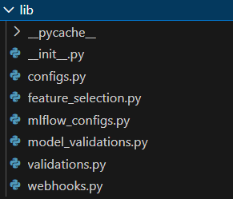
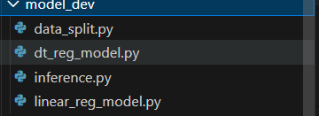
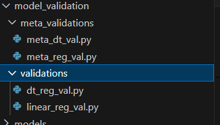
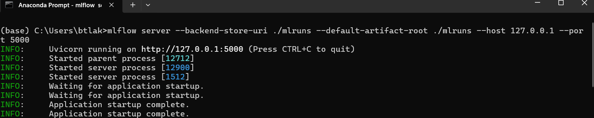
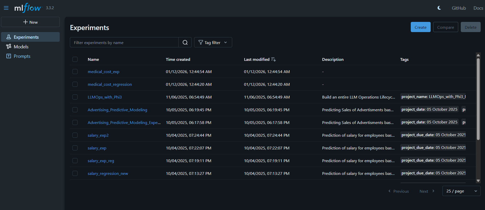
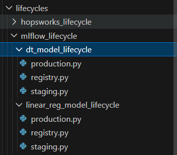
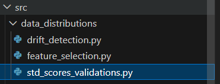
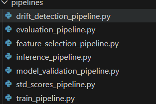

# ML SYSTEM FOR REGRESSION PROBLEM

This is a machine learning system designed for a regression medical cost problem.We predict the annual medical cost of clients based on their historical available data including transictions.

At first we extract the data,transform it and load it into the lakehouse .
Throughout each phase of data extraction,data quality checks are performed using great_expectations to ensure that we collected and are working with the correct data before machine learning 
comes into play. 

From there,we develop the models using the data we extracted and transformed in order to make future predictions. However since the aim is to develop a machine learning system ,in this case,we are working on a batch machine learning system. It should be noted that a batch machine learning system is the type of machine learning system in which we make predictions offline. This means that there might be no need to include online hosting using FastAPI to send predictions to the users but in a case where such should be made,Kafka plays a huge role.

Back to the system, model quality checks are performed in the same manner as data quality checks but with more consideration and focus on model metrics now.
Drift detection and feature selection are also performed with the use of deepchecks and a mathematical formulae developed with the use of statistical modeling rather than using built-in scikit-learn methods. Models ,metrics,data quality and model quality checks results are all saved in certain respective folders for proper structure of the distributed system.

Tools and libraries used in the workflow can be found in the requirements.txt file.

----

## Setup and Virtual Environment:

The first step before running any code or creating any files is creating a vritual environment to install these dependencies that will be used to accomplish the system. 
Using Windows,the following command on a Powershell terminal in vscode can be used to create the virtual environment:

python -m venv med_env

med_env is the name of the virtual environment ,it should be noted that one can name it as they like.

Then to activate the environment:

.\med_env\Scripts\Activate.ps1 

replacing med_env with the name of the virtual environment created

----

## Library:
Sofware Engineering is still relevant and important for ML and AI workflow especially when developing ML systems or chatbots or RAG pipelines. As such ,we develop our own library for the workflow which has five modules for reusability ,modularity and encapsulation.
This saves time and make it better to write production-grade ready code for ML/AI workflows.

For details of the modules,the configs module is for computing metrics and getting X_train,X_test,y_train and y_test in the entire workflow.Whenever needed ,we import it and use it.
Then feature_selection library will be used when checking for a shift in the data distribution and select relevant features with little drift in them.
mlflow_configs module will be used for the model deployment phase for reusability of mlflow configurations such as setting the mlflow host and experiment within the server. 
However mflow_configs is necessary too for managing the model lifecycles since we might retrain more models in the future based on the on-going development and monitoring.
model_validatins is the module for validating and testing if the model passes the quality checks and benchmarks we've set.
validations will be used for data quality checks to ensure correctness and accuracy of the data before machine learning consumption.
webhooks will be used for notifications.

Here is the library for the workflow found in the src/lib.

## ETL Workflow:

In the ETL workflow ,we are concerned with getting our hands on the dataset first.  The dataset is extracted from the database with the use of SQLAlchemy ,transformed with the use of pandas and loaded into the hopsworks lakehouse for future analytics and consumption. As explained in the each ETL phase,data quality checks are performed to ensure clean ,reliable ,consistent and accurate data before further 
work with it.

Here is the picture demonstrating how the ETL workflow is structured:

Only three folders are found-phases,pipeline and validations.

phases is where ETL is performed,pipelines for orchestrated pipelines that can be rescheduled and validations for data quality checks or data validations.

We focus on the etl_workflow which is in the src folder

----

### ETL Phases:

ETL Phases are executed first in the system. That is we need the data for machine learning consumption. Without data,no system can be built.
In the ETL PHASES workflow and structure

Only three phases -extract,transform and loading.

### Step 1: Extraction
Extract the raw data from the database with the use of SQLAlchemy and Pandas. 
Use dotenv and os libraries in Python to get the credentials and coonnect to the database for querying.
After extracting the data,save it in the data folder in a csv format.

The extraction file:

src/etl_workflow/phases/extract.py

Execution: python src/etl_workflow/phases/extract.py

---

#### Step 2:Transformation:
Here is a phase for checking missing values,performing necessary imputation where possible.
The transformation methods and operations are all performed over the extracted data
In this case,we add datetime and unique user ids as such these are the only transformations performed here.

The transformation file:

src/etl_workflow/phases/transform.py

Execution: python src/etl_workflow/phases/transform.py

---

#### Step 3: Loading:
After transforming the data and ensuring that it is clean,we load it into hopsworks which is the AI Lakehouse.

The loading file location:
src/etl_workflow/phases/loading.py

Execution: python src/etl_workflow/phases/loading.py

---

### Data Validation/Quality checks

Now we move onto data quality checks to ensure the correctness and accuracy of the data we are working with.

Here is the structure of data validations in the workflow.

---

Only two files exist here- data_vals and meta_data_vals. 
Data vals is where we perform the initial data validations and meta data validations is where we validate the data validations

#### Step 1: Data Validations

We perform the data validations with the use of great_expectations to ensure that the data passes all data quality checks and our expectations.

The initial data validations are executed by using the following command:

Execution: python src/etl_workflow/validations/data_vals.py

Then we save the validations results to the data_quality_checks in a csv format for meta validation workflow.

----

#### Step 2: Meta Data Validations

Meta data validations is just validations about validations.

Execution: python src/etl_workflow/validations/meta_data_vals.py

----

### DATA PIPELINES

Data Pipelines is refactoring the same ETL phases and Data Validations but with an orchestration framework which is prefect in this case.

Structure of the Data Pipelines. Still in the etl_workflow by the way.

Only two folders exist in the pipelines folder which are phase_pipelines and validations pipeline. 
phase_pipelines is where the ETL phases are orchestrated and validations is for orchestrating the data validations/quality checks

They still do the same thing but now break down long workflow or code into reusable components called tasks and execute within a flow.

---- 

## MODEL DEV

Model development is focusing on training machine learning models on train set and preparing them for future prediction task. 
Here the focus is mainly on four things - data_split ,tree model,linear model and inference.

First we split the data into train and test set where the train is used for model development and the test is reserved for model evaluation ,validation and inferencing.

Both the train and test sets are then saved into the data folder.
Inference is for making predictions on unseen data ,that is test dataset.

Here is the structure of the model development phase:

----

## MODEL EVALUATION

Model evaluation is a phase in the workflow where we evaluate the models and get the model metrics.
Three key metrics used in evaluating models for the system has to be R-squared,RMSE and MSE.
Once computed these metrics are then saved to the src/metrics folder

---
## MODEL VALIDATION

Model validation process is more or less the same as the data quality checks.
We create expectations that our models must pass in order to productionize them.
There are two folders in the model validation folder. 
Validations is for the initial model quality checks and meta validations is for validating the validations.
We validate the metrics which we computed in the model evaluation phase which can be found in the src/metrics folder

Here is the structure:

----

## MODEL DEPLOYMENT:

### Step 1: Run Mlflow
For model deployment,we use mlflow and hopsworks. 
However the focus will be more on mlflow since it might be difficult to get it started .
First open the Anaconda prompt on the local machine and here is the following command to run:

mlflow server --backend-store-uri ./mlruns --default-artifact-root ./mlruns --host 127.0.0.1 --port 5000

,this will get mlflow running.

Here is an image:

----

### Step 2: Create Experiment:
Here is how to now create an mlflow experiment.
Since mlflow is now running,go to local web browser and run:

http://127.0.0.1:5000/

Here is an image showing mlflow running:

Now on the navigations ,we have Experiments,Models and Prompts.
Our focus is on creating the experiment first then store and deploy our models within that experiment. It should be noted that failure to do so will result in automated and uncontrolled experiments which can be hard to re-run and keep track of in our code hence leading to models being stored in different experiments.

----

### Step 3:Model Lifecycles:

In the model lifecycles,we manage and version the models inside mlflow.
This is the advantage that mlflow has over other model storage tools such as hopsworks and weights & biases.

We register the model -> stage it -> productionize it.
If the model failed quality checks then we might as well as archive it to reserve storage and optimize resources for other incoming models that we might retrain in the future.

Now we are in lifecycles in the src folder focusing on mlflow.

We have two folders namely dt_model_lifecycle and linear_model_lifecycle with each having three files. 
The three files -> registry,staging and production which is the lifecycle of models.

---

## Data Distributions:
This is where we perform drift detection with the use of deepchecks.
We also use standard deviations for feature selection rather than built in scikit learn classes.

Focus shift onto data distributions in the src folder.

We only have three files- drift_detection,std_scores_validations and feature_selection.

In the drift detection- we use deepchecks. In the feature_selection -we check for any shift in the feature distributions and later validate those shifts in std_scores_validations.

## Pipelines:
This is where we orchestrate and reuse some of the code by breaking down them into simpler tasks.
Pipelines are just refactors and orchestration of all the above except for ETL workflow and Model Deployment.

